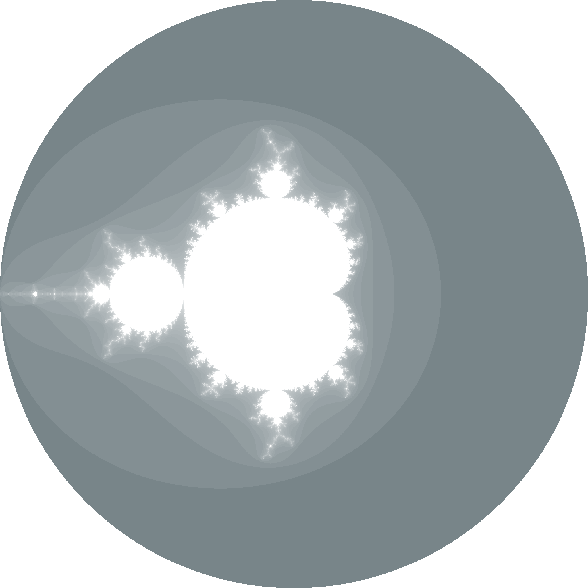
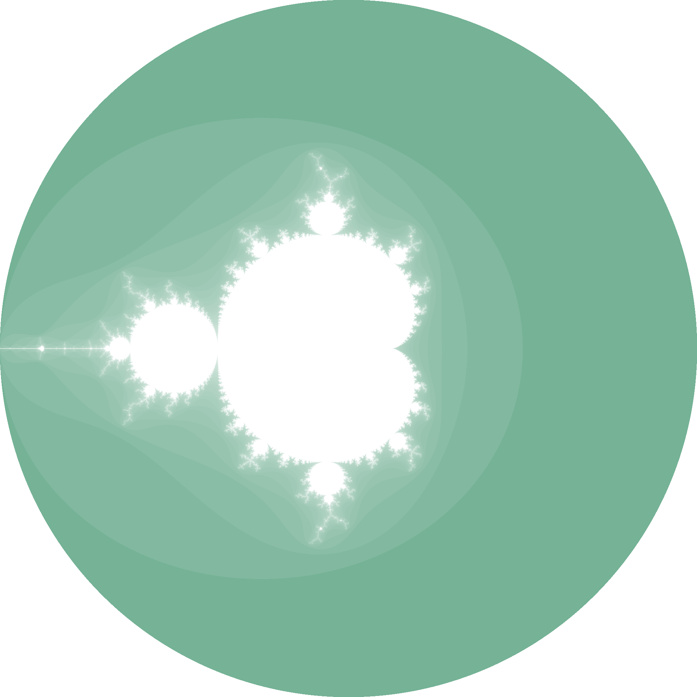
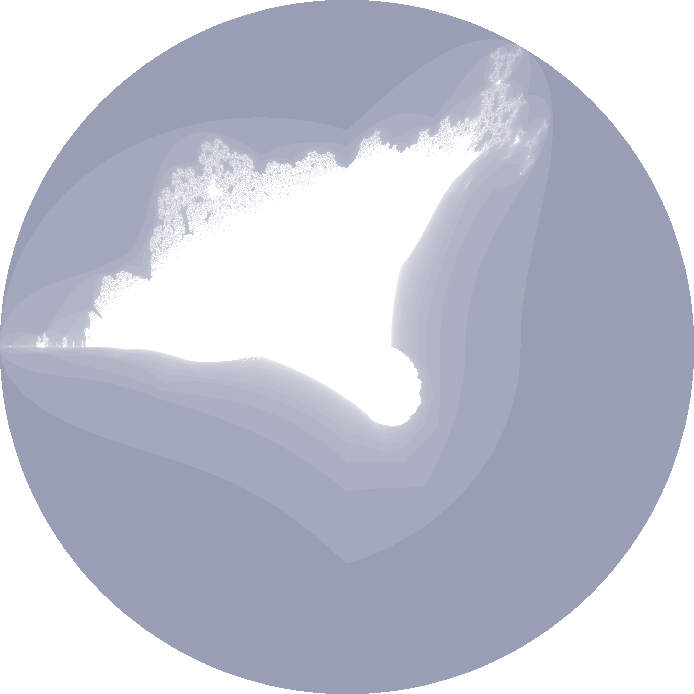
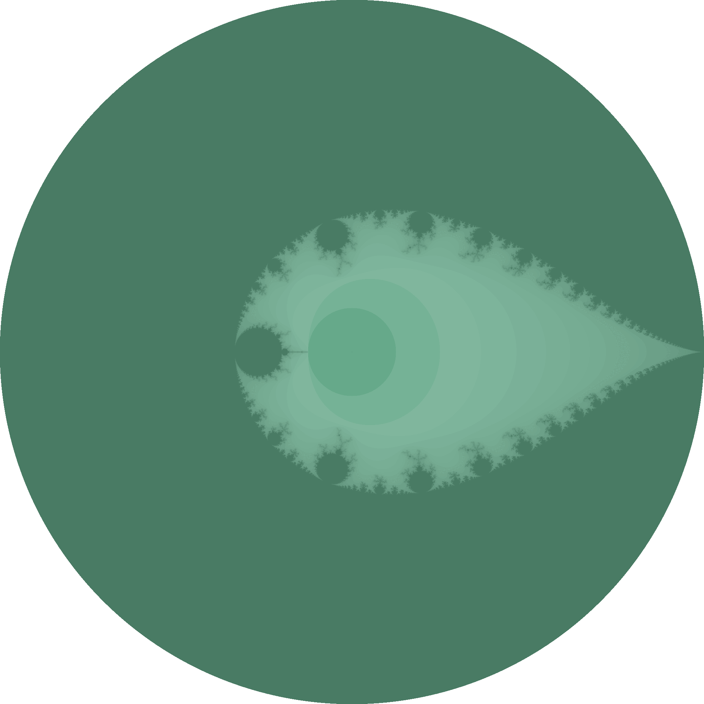
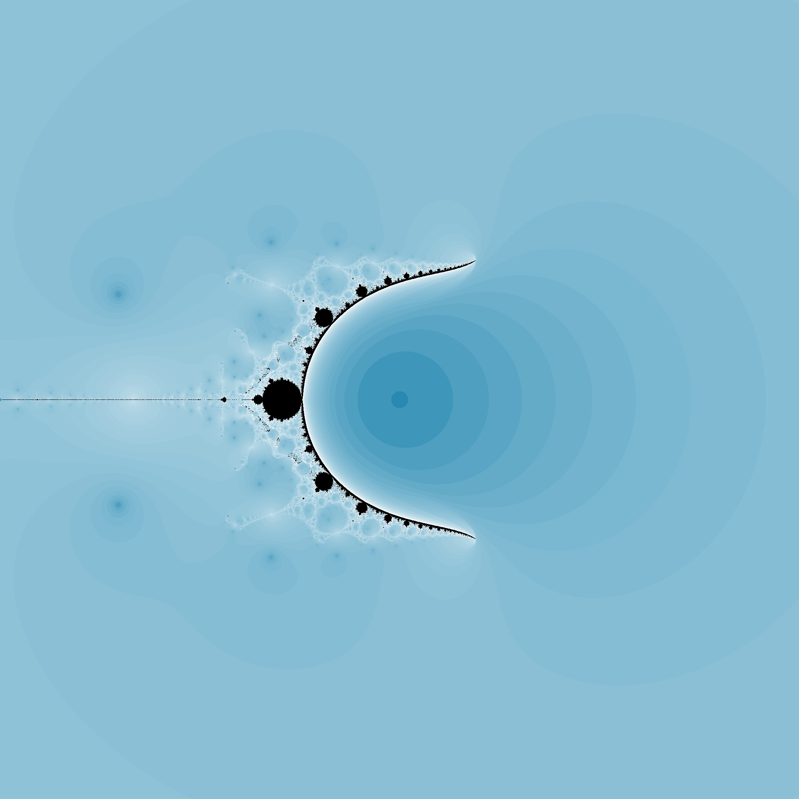

  
  <h1>fract-ol</h1>
  
Discover 2D programming and the psychedelic universe of fractals in this project, using minilibX.

## About the project
This will be the opportunity for you to get familiar with the MiniLibX, to discover or use the mathematical notion of complex numbers, to take a peek at the concept of optimization in computer graphics and practice event handling.

### Mandatory part
The program must offer the Julia set and the Mandelbrot set.
- The mouse wheel zooms in and out, almost infinitely (within the limits of the
computer). This is the very principle of fractals.
- The program must be able to create different Julia.
- A parameter is passed on the command line to define what type of fractal will be
displayed in a window.
  - The program can handle more parameters to use them as rendering options.
  - If no parameter is provided, or if the parameter is invalid, the program displays
a list of available parameters and exits properly.
- The program must use at least a few colors to show the depth of each fractal. It’s even
better if you hack away on psychedelic effects.

### Skills learned
- Advanced C programming.
- Graphics programming with MiniLibX.
- Mathematical concepts related to fractals.
- Memory management and optimization techniques.

### Bonus features
- One or more different fractals

| Multi Mandelbrot                                 | Multi Julia                             | Multi Burning Ship                                   |
|--------------------------------------------------|-----------------------------------------|------------------------------------------------------|
|  |   |  |
| $z$ and $c$ are complexes numbers                | $z$ and $c$ are complexes numbers       | $z$ and $c$ are complexes numbers                    |
| $z_{0} = 0$                                      | $z_{0}$ pixel position                  | $z_{0} = 0$                                          |
| $z_{n + 1} = z_{n}^p + c$                        | $z_{n + 1} = z_{n}^p + c$               | $z_{n + 1} =  \lvert z_{n}\lvert^p + c$              |
| $c$ : pixel position                             | $c$ : arbitrary choosen complexe number | $c$ : pixel position                                 |
| $p$ : power (here from 2 to 10)                  | $p$ : power (here from 2 to 10)         | $p$ : power (here from 2 to 10)                      |

| Multi Inverted Mandelbrot                                          | Newton                                         | Nova                                          |
|--------------------------------------------------------------------|------------------------------------------------|-----------------------------------------------|
|  |                    |                       |
| $z$ and $c$ are complexes numbers                                  | $z$ are complexes numbers                      |                                               |
| $z_{0} = 0$                                                        | $z_{0}$ pixel position                         | $z_{0}$ pixel position                        |
| $z_{n + 1} = z_{n}^p + \frac{1}{c}$                                | $$z_{n + 1} = z_n - \frac{z_n^3 - 1}{3z_n^2}$$ | $$z_{n + 1} = z_n - \frac{z_n^3 - 1}{3z_n^2}$$ |
| $c$ : pixel position                                               |                                                |                                               |
| $p$ : power (here from 2 to 10)                                    |                                                |                                               |

  - 
  - Newton fractal
  - Nova fractal
  - Inverted Mandelbrot
- The zoom follows the actual mouse position. 
- In addition to the zoom: moving the view by pressing the arrows keys. 
- Make the color range shift.

[//]: # (![Newton]&#40;https://github.com/user-attachments/assets/49d815b3-c687-4cc2-830f-8fa7548a1db3&#41;)
[//]: # (![Nova]&#40;https://github.com/user-attachments/assets/2b271d73-9d31-4c09-8ff7-208e9ab3fb03&#41;)
[//]: # (![mandelbrot-inverted-pow]&#40;https://github.com/user-attachments/assets/1bc0a56f-4a0f-4a0f-a513-dc7424282153&#41;)
[//]: # (![Multi Mandelbrot]&#40;https://github.com/user-attachments/assets/f91d527d-e99a-44af-ab39-c072ad4d107c&#41;)
[//]: # (![Multi Julia]&#40;https://github.com/user-attachments/assets/e340f792-e6dd-4e20-986b-213319858dd1&#41;)
[//]: # (![Multi Burning Ship]&#40;https://github.com/user-attachments/assets/7a2e0611-f1c3-45f1-8f5d-e96ede7197fc&#41;)
[//]: # (  )
[//]: # (  )
[//]: # (  )

## Getting started

## References

